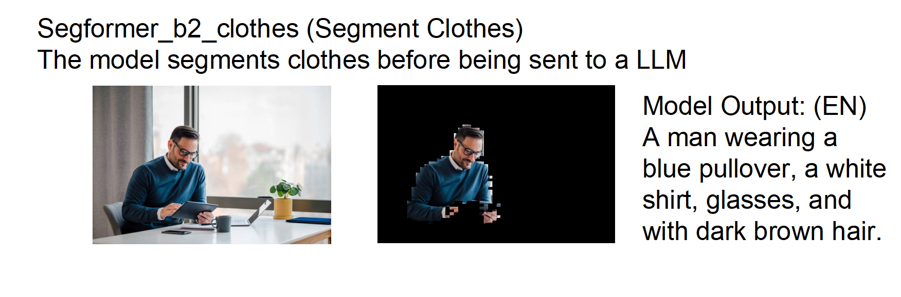
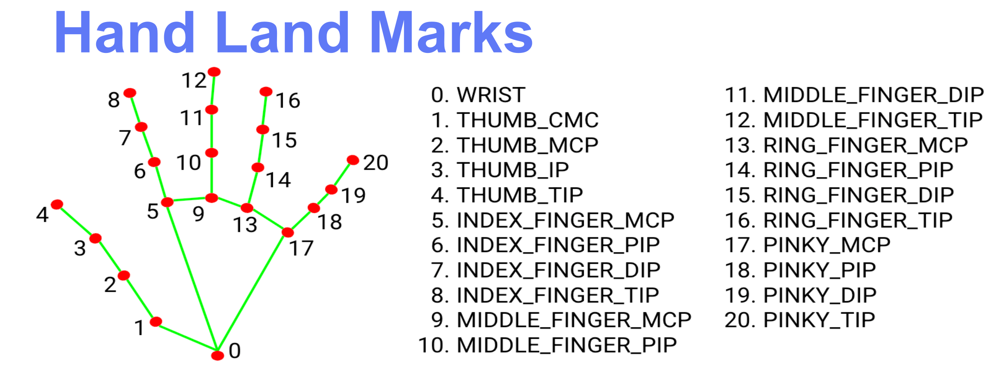
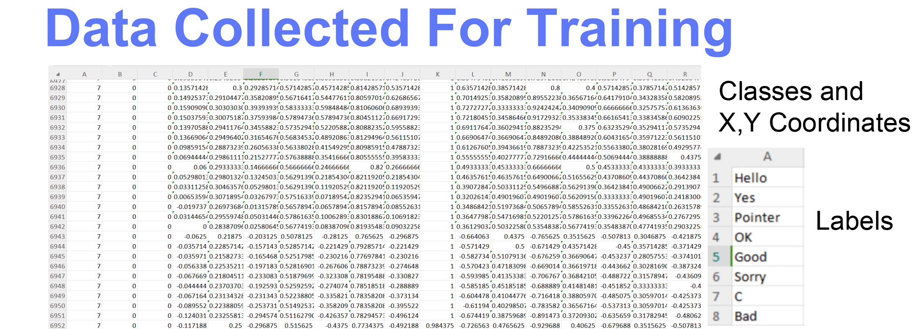
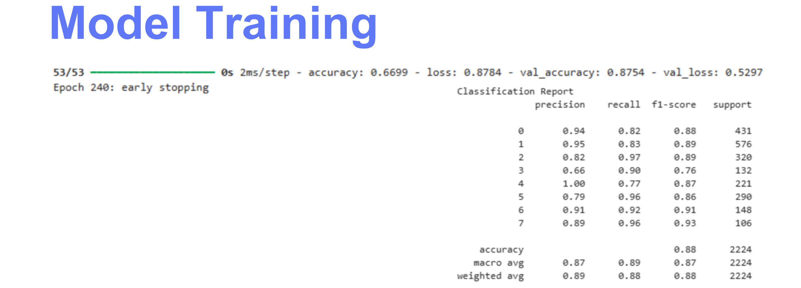

  
  
  
  
  
  

# YourEyes

YourEyes is a comprehensive mobile application developed in Unity, designed to assist visually impaired individuals by leveraging the power of computer vision and artificial intelligence. The application uses the device's camera to perceive the user's surroundings and provides real-time audio feedback in Arabic.

## Features

YourEyes offers a suite of powerful tools accessible through a simple tap-based interface:

*   **Distance Measurement**: Calculates and announces the distance to objects in front of the user. This feature is powered by a custom-built remote device using an **ESP32       microcontroller** paired with an **ultrasonic sensor**, which sends distance data to the mobile app in real time.
*   **Money Recognition**: Identifies and sums Egyptian Pound banknotes, detailing the count of each denomination.
*   **Clothes Analysis**: Describes the type and color of clothing items in view.
*   **Sign Language Interpretation**: Recognizes and translates basic hand gestures into spoken Arabic.
*   **Scene Description**: Generates and speaks a rich description of the surrounding environment.
*   **Facial Expression Recognition**: Detects human faces and identifies their expressions (e.g., happy, sad, angry).

## Core Technologies

The application is built with a combination of on-device and server-side technologies to deliver a responsive and intelligent experience.

*   **Frontend**: Unity Engine
*   **Computer Vision**: OpenCV for Unity
*   **On-Device Machine Learning**: Unity Barracuda for running `.onnx` models locally.
*   **AI Services**: Integrates with a backend that can leverage models like Google Gemini for complex analysis tasks.
*   **Backend Communication**: A client-server architecture where the Unity app communicates with a Python/Flask backend for processing commands and handling intensive AI tasks.
*   **Text-to-Speech (TTS)**: A custom TTS helper communicates with a dedicated service to provide real-time audio feedback in Arabic.

## Architecture

Your Eyes is built with **C#, Unity** and uses **OpenCV** and **TensorFlow Deep Learning** for recognition. Since Unity can’t run TensorFlow models natively, we train and export the TensorFlow models using **Python and Keras**, then export them into an **ONNX** file that can be accessed from Unity using **Barracuda**.

The system is split into a mobile client and a backend server:

1.  **Unity Client**: The main application running on the user's device. It manages the camera feed, UI, and user input (single/double taps). It runs lightweight models for real-time tasks like hand pose and money detection using the Barracuda engine.

2.  **Backend Server ([Repo](https://github.com/Saif-eldin-Ahmed-Helmy/YourEyes-Backend))**: A Python/Flask server is required to handle more computationally expensive tasks. The Unity client sends API requests with image data for:
    *   `/clothes`: Clothing analysis.
    *   `/describe`: Scene description.
    *   `/tts`: Text-to-speech conversion.
    *   `/command`: A polling endpoint to receive commands from external hardware (like distance sensor data).

## Modules Overview

*   **MainMenuController**: The application's central nervous system. It handles tap gestures to switch between different functional modes and sends captured frames to the appropriate processing module.
*   **MoneyDetection**: Uses an on-device YOLO model (`money_recog.onnx`) to detect banknotes. It collects detections over a 3-second window to stabilize the results before announcing the total and a breakdown of bills.
*   **HandPoseEstimator**: Implements a two-stage process. First, it uses MediaPipe's palm and hand pose models (via OpenCV) to extract 21 key hand landmarks. These landmarks are normalized and fed into a custom `hand_pose_estim.onnx` classifier to recognize specific gestures, which are then vocalized.
*   **ClothesAnalysis**: Captures an image and sends it to the `/clothes` backend endpoint. The resulting JSON, containing a detailed analysis and an Arabic summary, is parsed and read aloud.
*   **FacialExpression**: Employs a `YuNetV2` model for face detection and a separate model for expression classification. It analyzes the main face in the frame for 5 seconds and announces the detected emotion.
*   **SceneDescription**: Sends a camera frame to the `/describe` endpoint and speaks the returned caption.
*   **TTSHelper**: Provides a static `Speak(string)` method, enabling any module to easily convert Arabic text into speech by sending it to the TTS server.

## How It Works

To deliver accurate and accessible results, each feature follows a carefully designed pipeline:

### Clothes & Scene Analysis
1. The captured image is first **segmented** to isolate key objects and regions (clothes, faces, background).  
2. Segmentation ensures higher accuracy by reducing noise and focusing the model only on relevant portions of the frame.  
3. The processed image is sent to the backend (`/clothes` or `/describe`) where advanced models (SegFormer + BLIP + Gemini API) generate structured JSON output and an Arabic summary.  
4. The summary is converted into speech and announced to the user.  

  
*Semantic segmentation highlighting clothing regions for more precise analysis.*  

---

### Sign Language Interpretation
1. The camera feed is analyzed with **MediaPipe** to detect hand landmarks (21 key points).  
2. These landmarks are normalized and fed into a custom ONNX classifier trained on labeled hand gesture data.  
3. The classifier predicts the most likely gesture (e.g., hello, stop, thank you).  
4. The recognized gesture is vocalized in Arabic using the TTS system.  

  
*Extracted hand landmarks used for gesture recognition.*  

  
  
*Prototype training of the gesture recognition model using annotated hand pose data.* 
