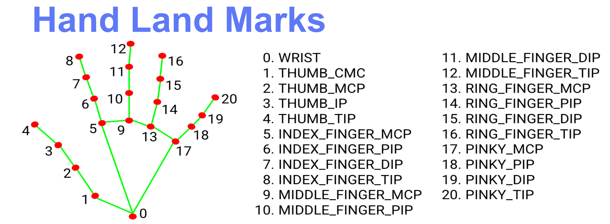
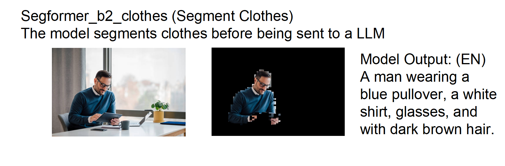

# YourEyes

Unity/C# assistive-vision prototype exploring camera input and Arabic spoken feedback. This repository is a partial Unity source export containing application scripts and sample images.

## Source modules

- `MainMenuController`: selects a mode and dispatches camera frames.
- `MoneyDetection`: banknote detection using an external ONNX model and a short aggregation window.
- `HandPoseEstimator`: hand-landmark processing and an external ONNX gesture classifier.
- `FacialExpression`: face detection and expression classification using external models.
- `ClothesAnalysis`, `SceneDescription`, and `TextTranslation`: calls to image/text processing endpoints.
- `TTSHelper`: requests spoken Arabic feedback from the backend.

The companion [Python backend](https://github.com/Saif-eldin-Ahmed-Helmy/YourEyes-Backend) contains Flask endpoints, pretrained-model integrations, and provider calls. That repository documents its environment and lightweight tests.

## Project setup

Use these scripts with the matching Unity project, licensed OpenCV for Unity package, ONNX model files, and the companion Flask backend. Configure scene references and backend endpoints for your environment.

The modules explore banknote detection, individual gesture classification, facial expressions, image description, and Arabic spoken feedback.

## Screenshots

Example outputs from the prototype.
